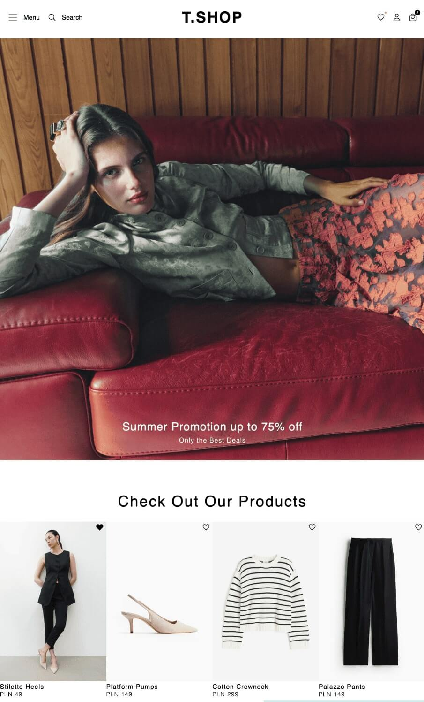
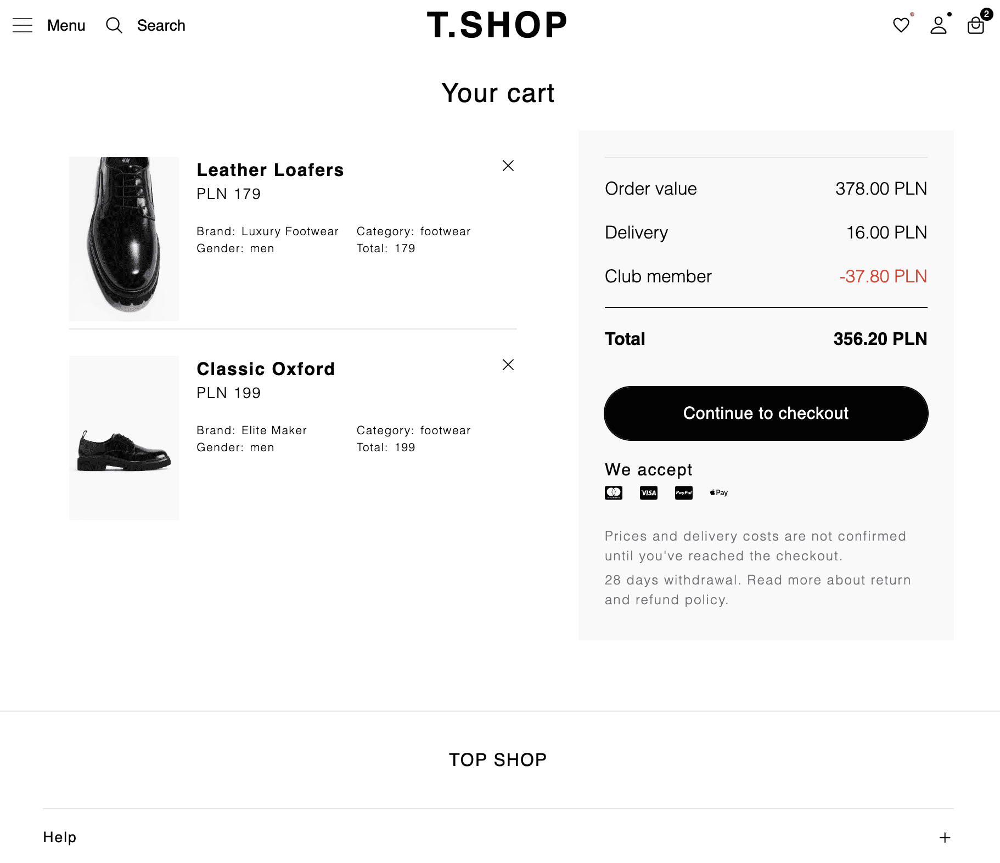
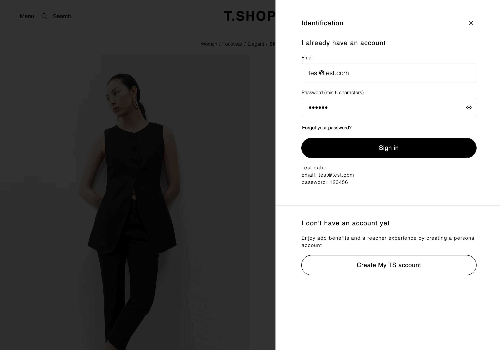

# TopShop - online shop with login function

See the live version of <a href="https://top-shop-sooty.vercel.app" target="_blank">TopShop</a>.

This project is a minimalistic online shop built using React, TypeScript, React Router v6, React Query and Styled-Components. It leverages Supabase for login authorisation and account creation.

**Main features**:

-   **Supabase**: Used as a login and authorisation tool.
-   **Minimalistic Layout**: Focuses on product with a clean, minimalistic product page.
-   **React Query and React Router**: Both used for data fetching.
-   **User's favourites**: Using both local storage and supabase for user's favourites.
-   **Forms**: Uses React Hook Form for form validation.
-   **Backend**: Backend built in JSON and published on Vercel.

&nbsp;

## 💡 Technologies

&nbsp;

## 💿 Installation

The project uses [node](https://nodejs.org/en/) and [npm](https://www.npmjs.com/). Having them installed, type into the terminal: `npm i`.

&nbsp;

## 🤔 Solutions provided in the project

-   **Handling User's Favourites:** When not logged in, favourites are stored in local storage. After logging in, they are synced with the user's account.
-   **Sidebar Navigation Menu:** The navigation menu is multilayered and offers fetching and rendering of bestsellers according to the category type.
-   **Header Searchbar:** The header searchbar is connected to rendering bestsellers and features a smooth animation with a delay.
-   **Product Page:** The product page implements two galleries for mobile and desktop, offering a minimalistic experience that emphasizes product photos.

&nbsp;

-   **Product page with scrollable gallery**:

-   **Cart view**:

-   **Login view**:

&nbsp;

## 💭 Possible future features

-   **Expand Landing Page**: Implement a time-specific collection with videos.
-   **Dashboard**: Implement a dashboard with order history.
-   **Contact Page**: Contact page with social media links.
-   **Adding Tests**: Implement integration tests.

&nbsp;

## 🙋‍♂️ Feel free to contact me

Find me on [LinkedIn ](https://www.linkedin.com/in/marcin-kulbicki-426817a4/) or [Instagram](https://www.instagram.com/yakksiek/)
